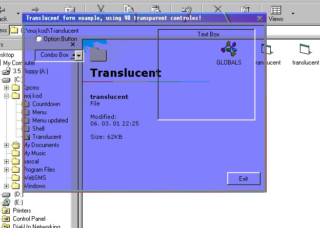

## Form translucent

### Description

Translucent form, that uses some VB transparent controles, I wrote this code using some module that wasnt mine so i like to thank the author for his contribution to my code! Please vote, and leave feedbacks!

I am planing of making a version of translucent, sinable and resizable form!
 
### More Info
 

             |
---                |---
**Submitted On**   |2001-03-06 22:25:38
**By**             |[\[°N €o°\]](https://github.com/Planet-Source-Code/PSCIndex/blob/master/ByAuthor/n-o.md)
**Level**          |Beginner
**User Rating**    |4.7 (28 globes from 6 users)
**Compatibility**  |VB 5\.0
**Category**       |[Custom Controls/ Forms/  Menus](https://github.com/Planet-Source-Code/PSCIndex/blob/master/ByCategory/custom-controls-forms-menus__1-4.md)
**World**          |[Visual Basic](https://github.com/Planet-Source-Code/PSCIndex/blob/master/ByWorld/visual-basic.md)
**Archive File**   |[CODE\_UPLOAD16112362001\.zip](https://github.com/Planet-Source-Code/n-o-form-translucent__1-21556/archive/master.zip)

